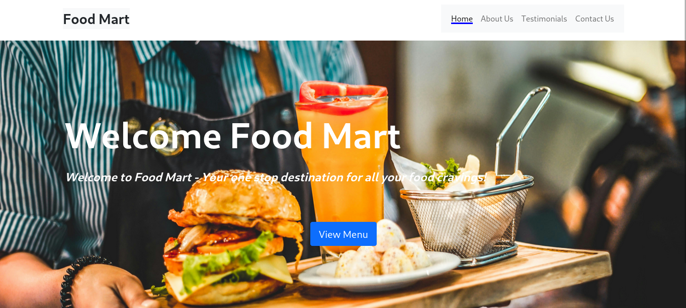
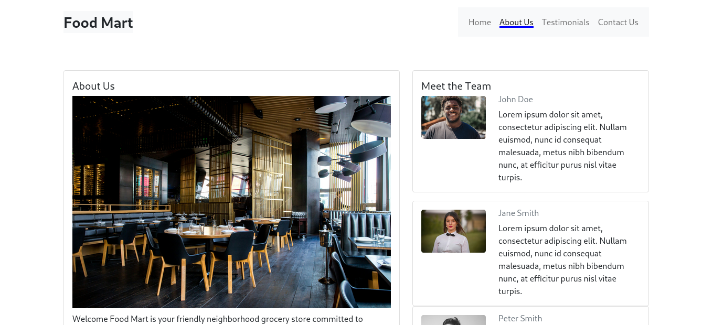
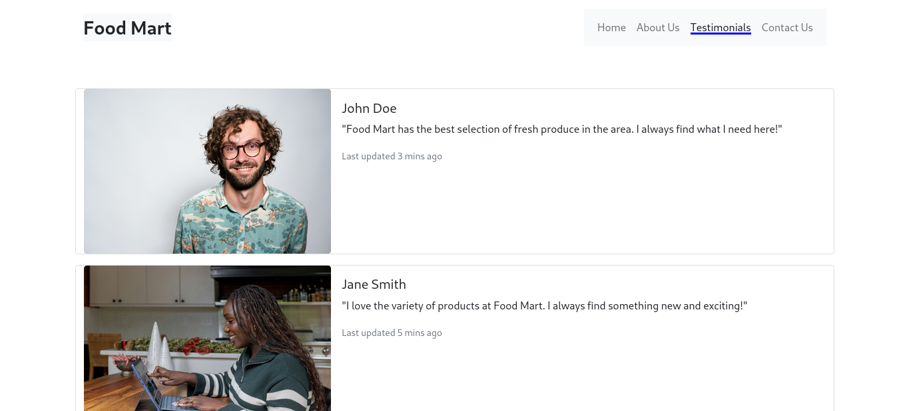
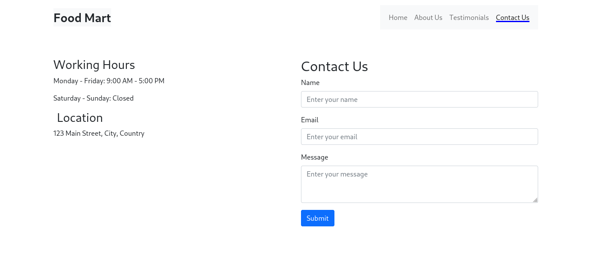

# Foodmart Landing Page

A modern landing page for Foodmart, built with Node.js, featuring:

* A clean and responsive design
* Screenshots of the home, about us, testimonials, and contact us pages
* A description of the features and benefits of using Foodmart

## Screenshots

### Home

### About Us

### Testimonials

### Contact Us

### 404

## Features

* Built with Node.js
* Responsive design
* Easy to use and navigate
* Features screenshots of the different pages

## Technologies Used

* Node.js: Backend programming language for server-side logic
* HTML5: Markup and styling of web pages
* Bootstrap 5: Front-end framework for responsive design and UI components

## Setup Instructions

Clone the repository: https://github.com/AKW254/FoodMart.git

Start the application:

- Ensure you have Node.js and a web server (e.g., Apache) installed on your system.
- Configure the web server to point to the project's root directory.
- Start the web server.
- Open the application in a web browser.

## License

The Foodmart Landing Page project is licensed under the MIT License. You are free to use, modify, and distribute the project in accordance with the terms of this license.

## Acknowledgments

* Node.js - A popular server-side JavaScript runtime environment.
* Bootstrap 5 - CSS framework for styling the project.
* Unsplash - Source of images used.

## Contact

If you have any questions or inquiries about the Foodmart Landing Page project, please contact Antony Kilonzo Wambua.

Support Email: anatoli@devlan.co.ke

